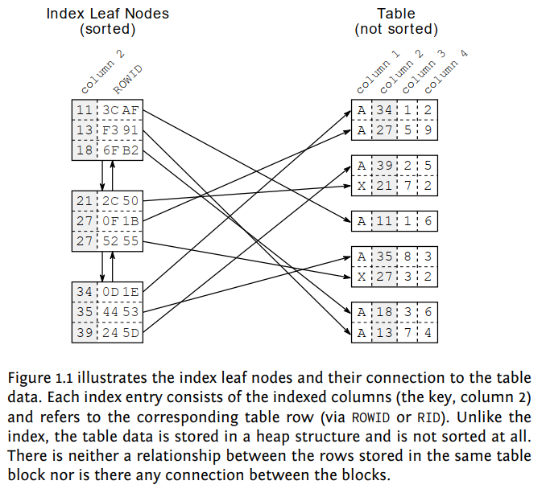
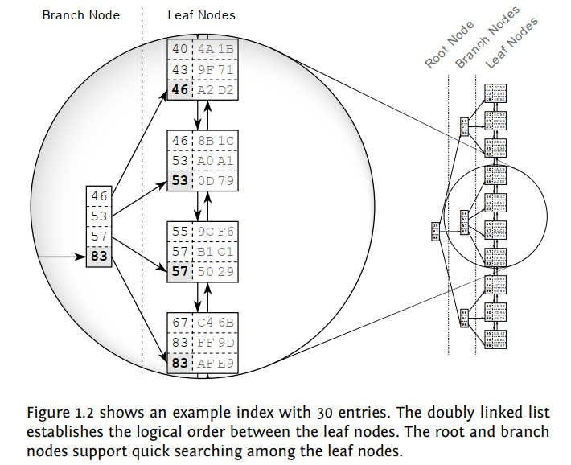
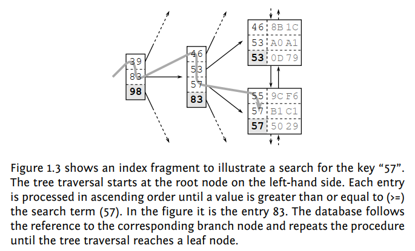

# Indexes 

Indexes are schema objects for speeding up the retrieval of rows by using a pointer. 

* Basically, indexes improve performance of queries. 
* Because indexes have pointers, it directly points to a related row. (Locate to the exact location of the data in the disk rather than scanning all the disk). This is much faster than the normal way. 
* If there is no index for a column, "full-table scan" occurs. 
* Indexes are created explicitly or automatically (with creating primary or unique constraint). 
* After creating an index we do not directly do anything. Oracle Server automatically maintains indexes. 
* Indexes are tied to a table but have no effect on the base table that means if we drop an index, nothing changes in the base table. 
* If we drop a table, all the indexes related to this table are also dropped. 
* Indexes are used only when we refer to the index column in WHERE clause . 

### Anatomy of Index

The key concept is that all entries are arranged in a well-defined order. Finding data in an ordered data set is fast and easy because the sort order determines each entries position. The database combines two data structures to meet the challenge: a doubly linked list (to make it easy to incorporate DB updates) and a search tree. These two structures explain most of the database’s performance characteristics.

#### Index Leaf Nodes

Databases use doubly linked lists to connect the so-called index leaf nodes. Each leaf node is stored in a database block or page; that is, the database’s smallest storage unit. All index blocks are of the same size—typically a few kilobytes. The database uses the space in each block to the extent possible and stores as many index entries as possible in each block. That means that the index order is maintained on two different levels: the index entries within each leaf node, and the leaf nodes among each other using a doubly linked list.

#### The Search Tree (B-tree)

The index leaf nodes are stored in an arbitrary order—the position on the disk does not correspond to the logical position according to the index order. It is like a telephone directory with shuffled pages. If you search for “Smith” but first open the directory at “Robinson”, it is by no means granted that Smith follows Robinson. A database needs a second structure to find the entry among the shuffled pages quickly: a balanced search tree— in short: the B-tree.

The figure highlights a branch node and the leaf nodes it refers to. Each branch node entry corresponds to the biggest value in the respective leaf node. That is, 46 in the first leaf node so that the first branch node entry is also 46. The same is true for the other leaf nodes so that in the end the branch node has the values 46, 53, 57 and 83. According to this scheme, a branch layer is built up until all the leaf nodes are covered by a branch node. 

The next layer is built similarly, but on top of the first branch node level. The procedure repeats until all keys fit into a single node, the root node. The structure is a balanced search tree because the tree depth is equal at every position; the distance between root node and leaf nodes is the same everywhere. 

Once created, the database maintains the index automatically. It applies every insert, delete and update to the index and keeps the tree in balance, thus causing maintenance overhead for write operations.

#### Tree Traversal

#### Slow Indexes

Despite the efficiency of the tree traversal, there are still cases where an index lookup doesn’t work as fast as expected. This contradiction has fueled the myth of the “degenerated index” for a long time. The myth proclaims an index rebuild as the miracle solution. 

The first ingredient for a slow index lookup is the leaf node chain. Consider the search for “57” in Figure 1.3 again. There are obviously two matching entries in the index. At least two entries are the same, to be more precise: the next leaf node could have further entries for “57”. The database must read the next leaf node to see if there are any more matching entries. That means that an index lookup not only needs to perform the tree traversal, it also needs to follow the leaf node chain. 

The second ingredient for a slow index lookup is accessing the table. Even a single leaf node might contain many hits—often hundreds. The corresponding table data is usually scattered across many table blocks (see Figure 1.1, “Index Leaf Nodes and Corresponding Table Data”). That means that there is an additional table access for each hit. 

An index lookup requires three steps: (1) the tree traversal; (2) following the leaf node chain; (3) fetching the table data. The tree traversal is the only step that has an upper bound for the number of accessed blocks—the index depth. The other two steps might need to access many blocks—they cause a slow index lookup.

Oracle server helps us determining the type of scan in following ways: -

##### INDEX UNIQUE SCAN

The INDEX UNIQUE SCAN performs the tree traversal only. The Oracle database uses this operation if a unique constraint ensures that the search criteria will match no more than one entry.

##### INDEX RANGE SCAN

The INDEX RANGE SCAN performs the tree traversal and follows the leaf node chain to find all matching entries. This is the fallback operation if multiple entries could possibly match the search criteria.

##### TABLE ACCESS BY INDEX ROWID

The TABLE ACCESS BY INDEX ROWID operation retrieves the row from the table. This operation is (often) performed for every matched record from a preceding index scan operation.

The important point is that an INDEX RANGE SCAN can potentially read a large part of an index. If there is one more table access for each row, the query can become slow even when using an index.

### Types of Indexes (Unique - Nonunique Indexes) 

* **Unique Index**: Oracle Server automatically creates this index while creating a primary key or unique constraints. We can manually create unique indexes but it is recommended to create a unique constraint instead. With that way a unique index will be created implicitly. 
* **Nonunique Index**: These indexes are created by a user for improving performance with any column or columns. 
* **B-tree Indexes** : Default index type is B-tree that means if we don't specify anything we create B-tree indexes. Useful for high cardinality columns. (if most of the values are different using B-tree indexes will be faster) 
* **Bitmap Indexes** : Used with bitmap keyword. Useful for low cardinality columns. (Bitmap indexes will be faster if there are lots of duplicate values) 
* Bitmap indexes can not be unique. (We can not use unique keyword with bitmap) 

### Function Based Indexes 

* Normally, to run an index we refer to indexed columns but if we use some functions with these columns, indexes do not run and full-table scan occurs. 
* In these situations we use function based indexes for speeding up the query. 
* These functions can be SQL functions or user-defined functions. 
* For creating a function based index, you need to have QUERY REWRITE system privilege. 
   ~~~~sql 
   CREATE INDEX first_name_idx ON EMPLOYEES(LOWER(first_name));
   ~~~~
* Oracle Server uses this index only when this function is used in a query. 
* Without a WHERE clause Oracle Server perform full table scan even if the table has many indexes. 

### Multiple Indexes for same column(s)

* We can have multiple indexes defined for same column(s)

  ~~~~sql
  ALTER INDEX emp_phone_ix INVISIBLE;
  ~~~~

### Dropping an Index 

* We use DROP INDEX command to remove an index. 

* We need to have DROP an INDEX privilege or we must be owner of the index to remove an index. 

* Indexes **can not** be modified. To change an index we just drop an recreate it. 
  
   ~~~~sql
   DROP INDEX indexname;
   ~~~~
   
* If we drop a table all the indexes are dropped automatically. 

* If we want to allow DML operations while dropping an index we use ONLINE keyword. 

   ~~~~sql
   DROP INDEX emp_phone_ix ONLINE; 
   ~~~~

   Note: We can not drop an index used by unique or primary key constraints.  Also we can use USER_INDEXES view to query information about indexes.

*Note: Anatomy of an Index section was covered from Markus Winand's book titled 'SQL Performance Explained'. Thank you Markus.*

